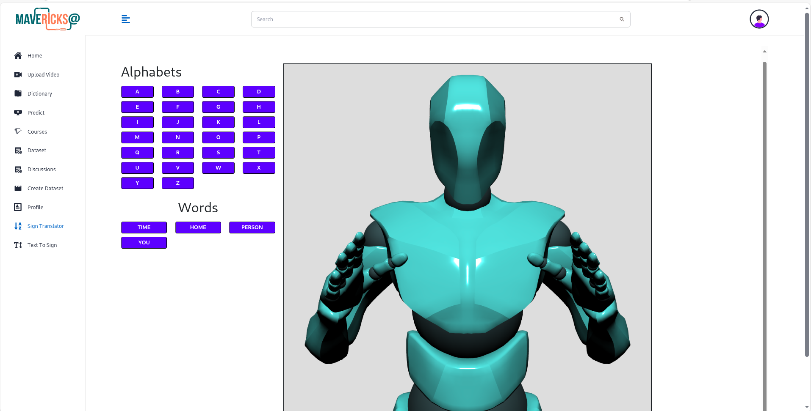

# Mavericks

## Introduction
- For source code please refer to: [Original Mavericks Repo](https://github.com/nitesh-20-2003/Mavericks_gui)

- For Live Demo please refer to: [youtube demo](https://www.youtube.com/watch?v=l_CLHfjUHV0)
- For Live Website demo please refer to: [live website ](https://maverick-client-ajot.vercel.app/)

## 🛠️ My Responsibilities (Nitesh Sharma)

- Developed the **frontend** using **React.js**, **Tailwind CSS**, and **Styled Components**, focusing on clean, reusable, and maintainable code.
- Implemented **JWT-based user authentication** and handled **routing** in both the **Express.js server** and the **React.js application**.
- Designed and developed the **data pipeline** that manages how individual frames travel from the frontend to the backend using **Socket.IO**, ensuring real-time processing.
- Optimized performance by implementing **parallel processing** across multiple servers, reducing latency and increasing accuracy by sending individual frames at **1.3-second intervals**.
- Contributed to the creation and curation of the **dataset** used for training the machine learning model.
- how much time an simple request for 8sec video take when using simple post requerst
- 

## 🚀 Features

- 📂 **Crowdsourced Dataset Building**  
  Contributors can easily upload and contribute to shared datasets.

- ⚙️ **Non-Manual Feature Learning**  
  Built-in real-time modules automatically detect and extract features without manual intervention.

- 🧑‍🔬 **Research-Friendly Platform**  
  Researchers can access curated datasets and advanced tools to conduct experiments and develop new models.

- 🎓 **Learning Hub for Beginners**  
  A dedicated section for learners to understand data, feature extraction, and real-time detection through interactive content.

- ✨ **Modern, Intuitive Layout**  
  Clean, responsive design with an easy-to-use interface for all user roles.

## An Higher Level Design of how Mavericks works
- 
- 
- 
## 📸 Screenshots
- 
- 
- 
- 
- 

